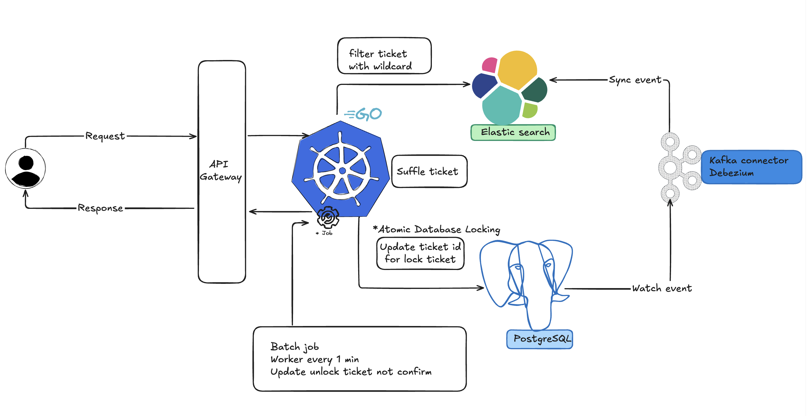

### Solution architecture
- CQRS (Command Query Responsibility Segregation) แยกการทำงานอย่างชัดเจนระหว่าง อ่านข้อมูลกับเขียนข้อมูล โดยฝั่งอ่านข้อมูลคือ Elasticsearch และฝั่งเขียนข้อมูลคือ RDBMS PostgreSQL
- ใช้หลักการ Event-Driven Sync คือ การ sync ข้อมูลข้ามระบบ จาก PostgreSQL ไป Elasticsearch โดยใช้ Debezium ที่เป็น source connector ใน Apache Kafka Connect

### Data Structures
- PostgreSQL
```
ticket_id      UUIDv7      -- primary key
ticket_number  CHAR(6)     -- เลข 6 หลัก
status         ENUM        -- AVAILABLE / LOCKED / SOLD
locked_until   TIMESTAMPTZ -- เวลาที่ lock จะหมดอายุ
```
- Elasticsearch (Read side)
```
{
  ticket_id: "...",
  ticket_number: "173025",   -- field type = wildcard (ES 7.9+)
  status: "AVAILABLE"
}
```

### algorithms
- Search with wildcard ด้วย field type โดยหลักการแล้ว Elasticsearch จะทำการแบ่งข้อความก่อน หลังจากนั้นจะทำเช็คข้อมูลซ้ำแบบละเอียดอีกที ซึ่งเป็น process engine ของ Elasticsearch
- Backend process shuffle tricket: สุ่มลำดับตั๋วที่ค้นเจอจาก Elasticsearch ก่อนเริ่มจอง เพื่อกระจายโหลด
- Atomic allocation: Update database with query command SELECT ... FOR UPDATE SKIP LOCKED
- Auto Reclaim ticket: Background worker คิวรีหาแถวที่ locked_until < now() เป็นระยะ แล้วคืนสถานะเป็น AVAILABLE เพื่อให้กลับมา search เจอได้อีก


### Recommended production database/storage
- Read Model: Elasticsearch รับหน้าที่ search ทั้งหมด เพราะเป็น search engine ทำให้ค้นหาข้อมูลเร็ว, สามารถ scale ได้ง่าย
- Storage: RDBMS PostgreSQL ทำหน้าที่จัดการ state การจอง โดยใช้ query command SELECT ... FOR UPDATE SKIP LOCKED

### Performance analysis summarizing efficiency and tradeoffs
- ระบบ search รูปแบบ wildcard ที่กำหนดไว้ ได้เร็วและรับโหลดได้สูง แลกมาด้วยความซับซ้อนเชิงโครงสร้างของระบบและการ maintain ระบบที่มีหลายส่วน

### Concurrency/distribution strategy explaining how duplicate results are avoided for the same pattern
- ป้องกันตั๋วซ้ำด้วย Postgres row-level lock (SKIP LOCKED)
- มีการสุ่มลำดับก่อนจอง เพื่อกระจายโหลดและเพิ่มความเร็วในการจอง

### high-level-overview
